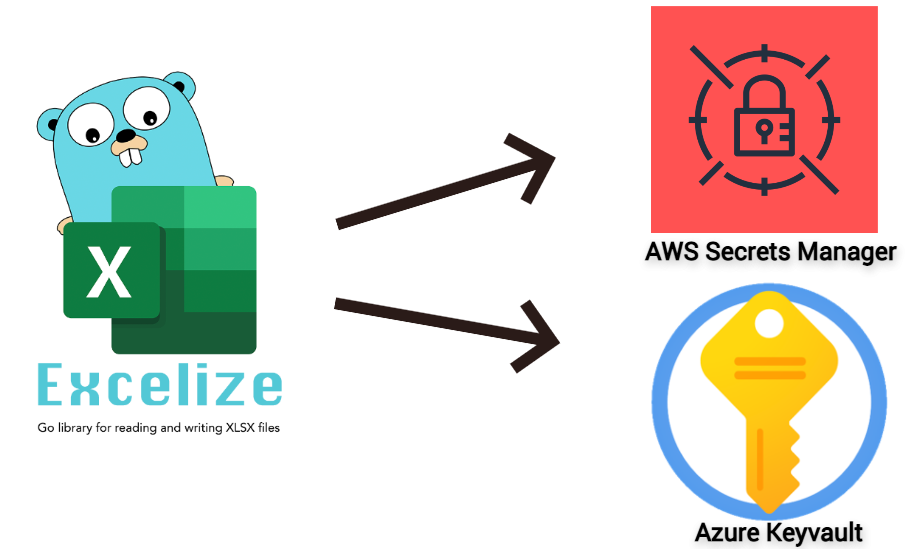

# GoLang Secret Loader with Excelize



This repository contains Golang module named as **"secret-loader"** having three Go packages(main, azure and aws). This Golang module is having two cloud provider options that the end user can make use of by specifyingthe provider of choice(aws or azure) via command line flag argument to the executable. Based on the provider flag argument provided, the service(aws secrets manager or azure keyvault) is picked up for loading secrets into. As one knows, that aws secret manager store stand-alone secrets without creating an instance of aws secrets manager itself unlike it is needed to have an azure keyvault instance to load secrets to, therefore if **"azure"** is provided as provider flag argument so **"akv"** flag argument must be provided which expects the azure keyvault instance name to load secrets into. As stated, no such flag as aws secrets manager name or other needs to be specified while providing **"aws"** as provider flag argument. Alongside the provider command line flag argument, this module also requires excel workbook and sheet name containing **"keys"** and **"values"** that are desired to be loaded into Azure keyvault or aws secrets manager to be provided by their respective command line flag arguments. Flag arguments that are needed or optional to be provided with the executable are as follows:

* provider(aws or azure)
* profile(only valid for **"aws"** provider)
* file(absoulte or relative path to excel workbook file to load secrets from)
* sheet(excel workbook's sheet name to load secrets from)
* akv(name of azure keyvault. This flag is only required with **"azure"** provider)

The main package is responsible for serving the entrypoint of module and performing basic operations like parsing command line flags as arguments to the resulting executable and reading from the excel workbook’s sheet provided using Excelize. Azure and Aws packages are responsible for doing all the authentication and authorization on their respective clouds and loading the secrets into their respective secret storing services(**"secret manager"** in case of **"aws"** provider and **"azure keyvault"** in case of **"azure"** provider respectively).

## Runbook

#### Prerequisites

* Excel workbook file should be present on the filesystem and provided sheet should exist inside the workbook provided. 
* Workbook's sheet should contain coulmn title as **"keys"** and **"values"** (case insensitive) for keys and values respectively.
* Golang version 1.19.x or above.
* If **"azure"** is selected as provider, the provided **"akv"** instance needs to be present on your Azure account you are authenticating with.
* If **"azure"** is selected as provider, **"az login"** should have been run prior to running the secret-loader executable as it for now perform authentication and authorization using the Azure CLI credentials.
* If **"aws"** is selected as provider, proper profile config should be present inside shared config i.e., **"~/.aws/config"**. You can visit [aws-named-profiles](https://docs.aws.amazon.com/cli/latest/userguide/cli-configure-profiles.html) for understanding and creating named profiles for aws and hence the shared config file. 


A step by step guide is as follows:

Clone this repository by running:
```sh
git clone https://github.com/Qumber-ali/secret-loader.git
```
After cloning the repository run the following command on the root of repository to resolve dependencies and build the executable:
```golang
go get -d ./... && go build seclo.go
```

After building the executable you are ready to load secrets.

Finally run the following command to load the secrets:
<br />  
**For Loading to AWS Secrets Manager with non-default aws profile**

```golang
./seclo --provider aws --file <path to excel workbook> --profile <aws profile name> --sheet <Sheet name containing keys and vaules>
```
<br />  

**For Loading to Azure Keyvault**

```golang
./seclo --provider azure --file <path to excel workbook> --sheet <Sheet name containing keys and vaules> --akv <Azure keyvault name>
```

Note you can also move this binary to path that is enrolled in "PATH" environment variable or you can append the binary's path into PATH environment variable to call the executable from anywhere on your filesystem.  


